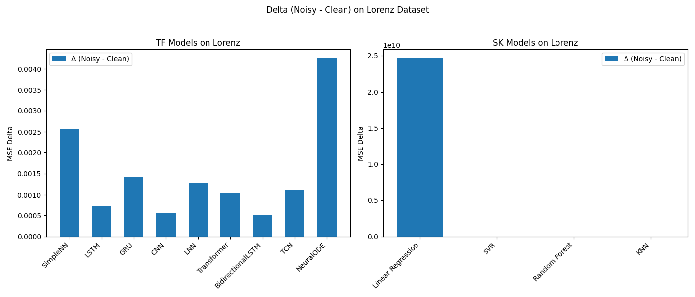
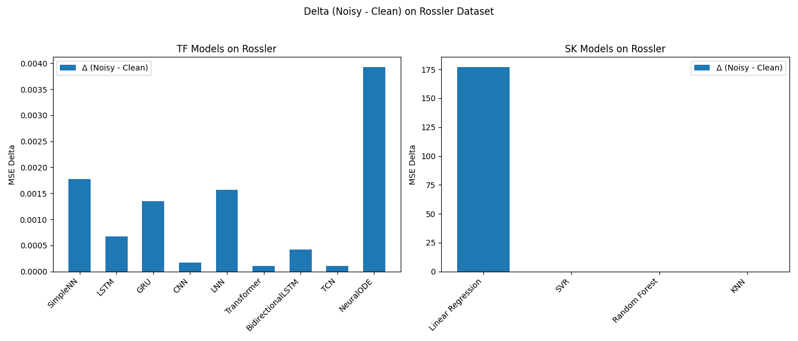
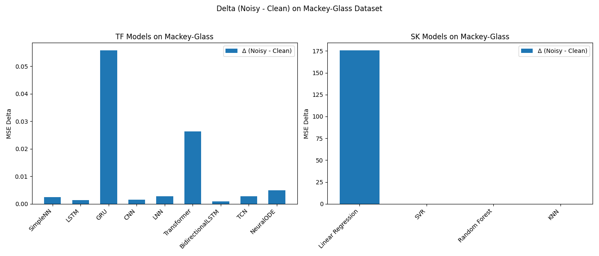
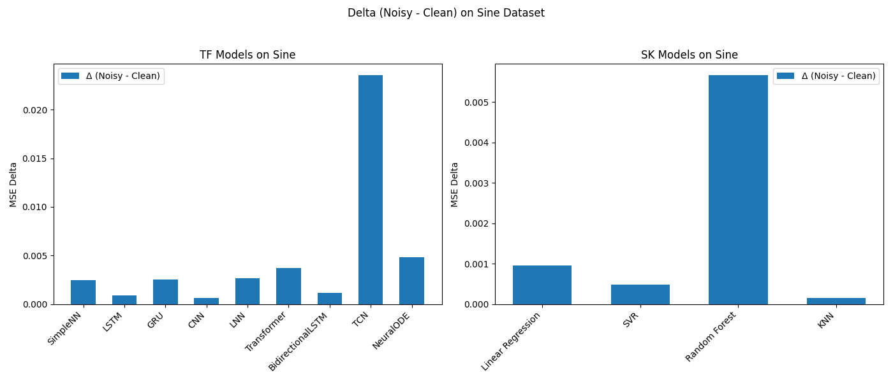

# NEOSENS: Noise Evaluation of Neural Network Output Sensitivity

## Overview
Welcome to **NEOSENS**, a project dedicated to evaluating the sensitivity of various machine learning and deep learning algorithms, including Liquid Neural Networks (LNN), to subtle input perturbations. Our primary goal is to assess the robustness of these paradigms in real-world applications, such as surgical robotics and self-driving cars, where small input noise should not compromise attention mechanisms. Inspired by the resilience of biological systems, like the human brain, **NEOSENS** investigates how AI can maintain stability and performance under noisy conditions.

## Project Objectives

- **Comparative Analysis**: Conduct an extensive comparative analysis of AI architectures, including Long Short-Term Memory (LSTM), Liquid Neural Networks (LNN), and Simple Neural Networks, in practical contexts.
- **Sensitivity Evaluation**: Investigate how these architectures respond to subtle input perturbations, similar to challenges encountered in self-driving cars and surgical robotics.
- **Attention Mechanisms**: Assess the efficacy of attention mechanisms in preserving focus amidst noise, inspired by the intricate neurological attention systems.
- **Application-Oriented Insights**: Generate practical insights into which architecture demonstrates superior noise tolerance without compromising attention mechanisms, making them ideal for safety-critical applications.

## Repository Structure

- **README.md**: Project overview and instructions.
- **requirements.txt**: List of required Python packages.
- **setup.py**: Setup script for packaging the project.
- **LICENSE.md**: License information.
- **assets/**: Contains the visualizations for analysis.
- **main.py**: Script to run the experiments.
- **src/**: Contains the source code.
  - **data/**: Functions for dataset generation (Lorenz, Rossler, Mackey‑Glass, Sine).
  - **models/**: Model definitions (TensorFlow/Keras and scikit‑learn).
  - **utils/**: Utility functions for noise injection and sliding window creation.
  - **experiments/**: Script to run experiments and compare model performance.

## How to Run

1. Install the required packages:
    ```bash
    pip install -r requirements.txt
    ```

2. Run the experiments:
    ```bash
    python main.py
    ```


## Main Results (Clean vs Noisy MSE)

The following table presents the **Mean Squared Error (MSE)** for each model across different datasets, comparing **clean** vs. **noisy** conditions.

| **Model**             | **Lorenz (Clean, Noisy)**  | **Rossler (Clean, Noisy)**  | **Mackey-Glass (Clean, Noisy)** | **Sine (Clean, Noisy)** |
|-----------------------|----------------------------|-----------------------------|---------------------------------|-------------------------|
| **SimpleNN**          | 0.0020, 0.0046             | 0.0002, 0.0020              | 0.0004, 0.0028                  | 0.0000, 0.0025          |
| **LSTM**              | 0.0000, 0.0008             | 0.0000, 0.0007              | 0.0013, 0.0027                  | 0.0000, 0.0009          |
| **GRU**               | 0.0000, 0.0014             | 0.0001, 0.0015              | 0.0005, 0.0561                  | 0.0000, 0.0025          |
| **CNN**               | 0.0006, 0.0012             | 0.0002, 0.0004              | 0.0002, 0.0018                  | 0.0000, 0.0006          |
| **LNN**               | 0.5045, 0.5058             | 0.6049, 0.6065              | 0.0466, 0.0493                  | 0.0026, 0.0052          |
| **Transformer**       | 0.0004, 0.0014             | 0.0007, 0.0008              | 0.2541, 0.2804                  | 0.0975, 0.1012          |
| **BidirectionalLSTM** | 0.0001, 0.0006             | 0.0000, 0.0004              | 0.0009, 0.0018                  | 0.0000, 0.0012          |
| **TCN**               | 0.0020, 0.0031             | 0.0003, 0.0004              | 0.0771, 0.0798                  | 0.0004, 0.0239          |
| **NeuralODE**         | 0.0004, 0.0046             | 0.0004, 0.0043              | 0.0005, 0.0054                  | 0.0000, 0.0048          |
| **Linear Regression** | 0.0000, 24623887889.3608   | 0.0000, 176.9267            | 0.0000, 175.5703                | 0.0000, 0.0010          |
| **SVR**               | 0.0043, 0.0046             | 0.0032, 0.0036              | 0.0043, 0.0050                  | 0.0070, 0.0075          |
| **Random Forest**     | 0.0002, 0.0050             | 0.0000, 0.0056              | 0.0007, 0.0062                  | 0.0000, 0.0057          |
| **KNN**               | 0.0009, 0.0012             | 0.0000, 0.0001              | 0.0029, 0.0029                  | 0.0000, 0.0002          |


## Delta (Difference between Clean and Noisy MSE)

The following table presents the **Delta (Δ)**, which represents the difference between the clean and noisy MSE values for each model across different datasets.

| **Model**             | **Lorenz (Δ)**  | **Rossler (Δ)**  | **Mackey-Glass (Δ)** | **Sine (Δ)** |
|-----------------------|-----------------|------------------|----------------------|--------------|
| **SimpleNN**          | 0.0026          | 0.0018           | 0.0024               | 0.0025       |
| **LSTM**              | 0.0007          | 0.0007           | 0.0013               | 0.0009       |
| **GRU**               | 0.0014          | 0.0014           | 0.0557               | 0.0025       |
| **CNN**               | 0.0006          | 0.0002           | 0.0016               | 0.0006       |
| **LNN**               | 0.0013          | 0.0016           | 0.0027               | 0.0026       |
| **Transformer**       | 0.0010          | 0.0001           | 0.0264               | 0.0037       |
| **BidirectionalLSTM** | 0.0005          | 0.0004           | 0.0009               | 0.0012       |
| **TCN**               | 0.0011          | 0.0001           | 0.0027               | 0.0235       |
| **NeuralODE**         | 0.0042          | 0.0039           | 0.0049               | 0.0048       |
| **Linear Regression** | 24623887889     | 176.9267         | 175.5703             | 0.0010       |
| **SVR**               | 0.0003          | 0.0004           | 0.0007               | 0.0005       |
| **Random Forest**     | 0.0048          | 0.0055           | 0.0055               | 0.0057       |
| **KNN**               | 0.0003          | 0.0001           | 0.0000               | 0.0002       |

---

### Visuals for Delta (Δ) Analysis

Below are the visualizations of the **Delta (Δ)** for each model across different datasets.

#### Lorenz Delta (Δ)



#### Rossler Delta (Δ)



#### Mackey-Glass Delta (Δ)



#### Sine Delta (Δ)




## Conclusion

The results across the various datasets show that **LSTM** and **Bidirectional LSTM** architectures exhibit strong robustness against noisy data, as reflected by their low delta between clean and noisy test losses. **Simple Neural Networks (SimpleNN)** generally show a moderate increase in error under noisy conditions but still maintain relatively low deltas across most datasets.

In contrast, more complex models like **NeuralODE** and **Transformer** exhibited larger increases in error, particularly in the Mackey-Glass and Sine datasets. This suggests that while these models are more expressive, they may not handle input noise as effectively as LSTM-based models in some cases.

**Liquid Neural Networks (LNN)** demonstrated an interesting characteristic: although their performance was slightly worse in some scenarios, they showed a remarkable tolerance to noise, making them an appealing choice for real-world applications where noise resilience is critical.

Overall, the LSTM and Bidirectional LSTM architectures stand out as the most reliable in maintaining performance across various levels of noise, especially in safety-critical domains like autonomous driving or surgical robotics, where robustness to minor perturbations is key.


## License

This project is licensed under the **DBaJ-NC-CFL** [LICENSE](./LICENCE.md).
